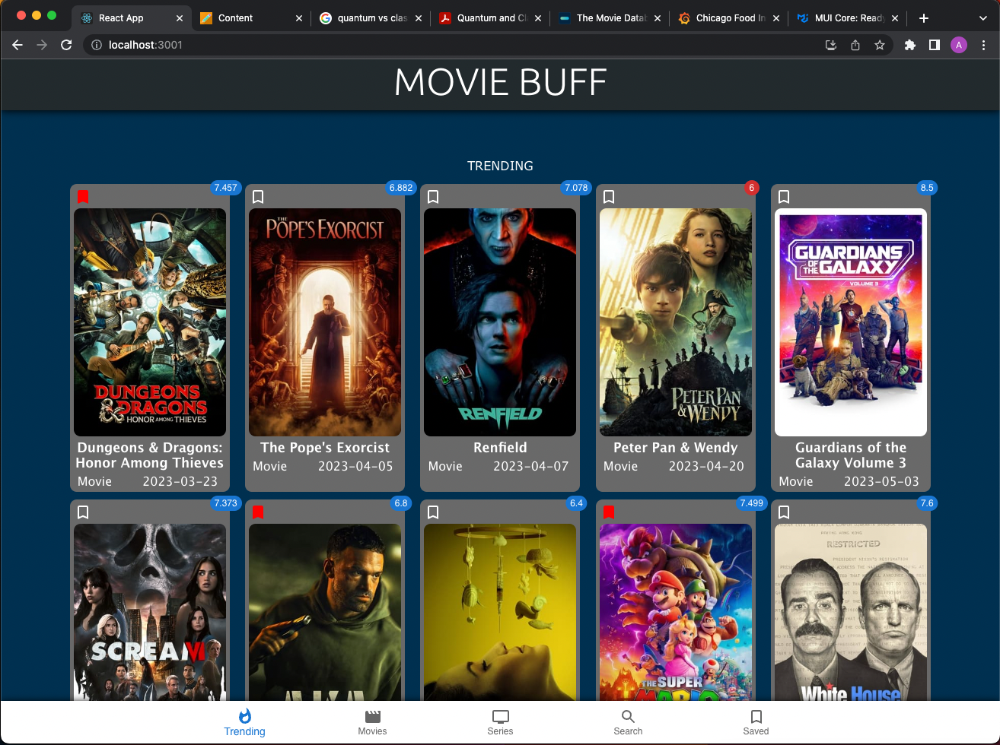
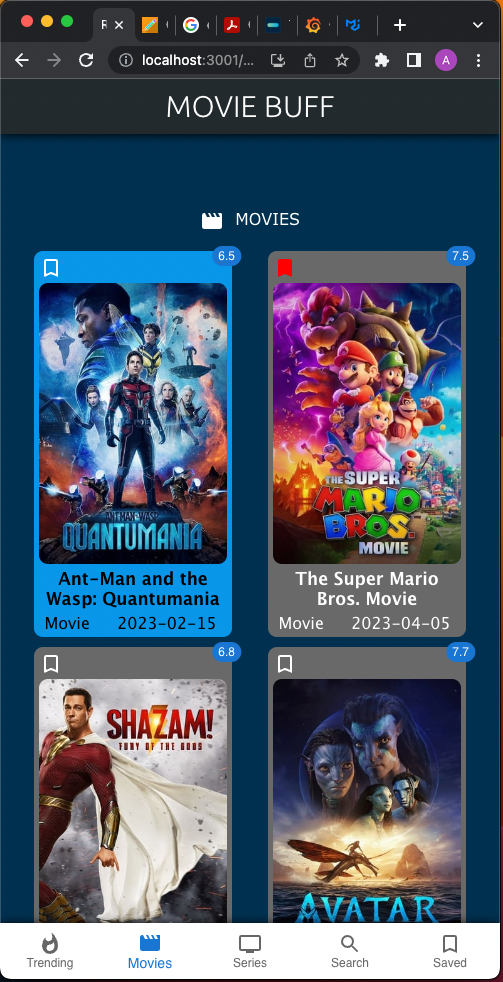

# Movie Buff

This react application is one stop movie destination for movie buffs. The application will provide the trending movie and tv series information. It has dedicated tabs for movie and tv series where you can see latest movies and tv-series to watch.

## Available Scripts

### `npm install`

Go to the movie-buff directory the same directory as package.json. Use the below command to install app.

### `npm start`

Runs the app in the development mode.
Open [http://localhost:3000](http://localhost:3000) to view it in your browser.

### API-KEY:

The api key from _[https://developers.themoviedb.org/]()_ is embeded into the script. So, to get started with this application **_my api-key can be used_**. I will delete this api-key once evaluation is done.

### Project Features

The application has following pages and corresponding features accessible via bottom navigation:

1. **Trending Page**: The trending page displays top 20 daily trending movies and tv-series.
2. **Movie Page**: The movie page has displays top movies to watch based on moviedb.org algorithm, popularity and online buzz.
3. **Series Page**: Similar to movie page the tv page has top tv-series to watch.
4. **Search Page**: In search page you search for movie even with partial match.
5. **Saved Page**: The saved page contains the movie card which a user has bookmarked. The bookmark is displayed in the order of bookmark.

### Actions that can be performed in the app:

**Trailer Watching**: On clicking on the poster of a movie-card a new tab will open with a youtube trailer for the correspoding movie or tv-series. If the trailer is not avaialble in the database, the click will have no action.

**Bookmarking a Movie**: A movie can be bookmarked by clicking on the bookmark icon of each tile. Once a user clicks on the bookmark the bookmark icon will turn red in color. The bookmarked movies will be displayed on the saved page.

**Unbookmarking a Movie**: The movie can be removed from saved page by clicking on the bookmark icon again. The color will change from red to icon with white border. When user revists the saved the bookmark will be gone.

### Technical Details:

**1. Bookmark Actions:** For saving bookmark I am using local storage. The data is saved in the same format as I receive it from the moviedb.org api.

**2. Icons and Some UI compenent**: For Icons, badge compenent and bookmark component I have material UI. The bootm Navigation bar is also MaterialUI component.

**3. Routing Pages:** Each routing page is defined in the **_pages_** folder.

**4. Smooth Scroll**: On clicking the header bar the page will be scrolled to top via smooth scrolling.

**5. Bottom and Header Bar:** The bottom and header have fixed position and z-index 100 so that it remains at the top evertime.

### Refrences:

[Movie DB API ](https://developers.themoviedb.org/ "developer documentation.")

[Material UI](https://mui.com/core/ "Material UI page")

Postman for api and response evaluation.

### Screenshots:

1. Normal View port:

### \* Mobile screen View:

**The END.. Thanks :)**
